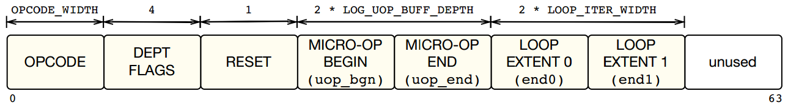
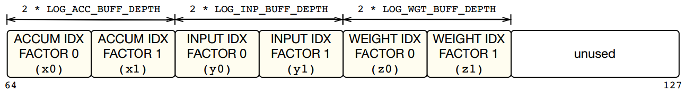

<!--
Filename: GEMM.md  
Description:
-->


<!------------------- begin of section 1 -------------------->

# 1&ensp;VTA Hardware Overview

<center>


</center>

## 1.1&ensp;Modules

### fetch module
- **Fetch module** 은 DRAM 으로부터 작업 명령어 (task instruction)를 가져와 각 명령어 부분을 형식에 맞는 명령 대기열(command queue)로 나누어 보낸다.
  - 명령 대기열(command queue): `LOAD CMD Q`, `COMPUTE CMD Q`, `STORE CMD Q`


### load module

- **Load module** 은 입력(input), 가중치(weight), 편향(bias) 텐서 타일을 DRAM 으로부터 on-chip memory로 불러온다.


### compute module

- **Compute module** 은 micro-op 이용하여 데이터를 가져오고 GEMM(GEneral Matrix Multiplication) 연산과 ALU (Arithmatic Logic Unit) 연산을 수행한다.

- **Tensor ALU**
  - The **tensor ALU** performs <u>element-wise tensor operations</u> such as (1)addition, (2) activation, (3) normalization, and (4) pooling tasks.

- **GEMM Core**
  - The **GEMM core** performs high-arithmetic intensity <u>matrix multiplication over input and weight tensors</u> to implement common deep learning operators such as 2D convolutions, or fully connected layers.


### store

- The store module reads results processed by the compute module and writes them to DRAM.


<br>

## 1.2&ensp;Queue

각 블록은 SRAM으로 구성된 queue와 데이터를 주고받는다.

<!-------------------- end of section 1 --------------------->

<br>

<br>

<!------------------- begin of section 2 -------------------->

---

# 2&ensp;GEMM Core

## 2.1&ensp;GEMM Instructio for Zedboard

### GEMM Instruction



### Section Size

- **`OPCODE`** = 3
  - `VTA_OPCODE_BIT_WIDTH` = 3

<br>

- **`LOG_UOP_BUFF_DEPTH`**  _(log2 of on-chip micro-op buffer depth)_
  = `VTA_LOG_UOP_BUFF_SIZE` - `VTA_LOG_UOP_WIDTH` + 3
  = 15 - 5 + 3
  = **13**
  - `VTA_LOG_UOP_WIDTH` = 5  _(log2 of micro op data type width)_
  - `LOG_UOP_BUFF_SIZE` = 15

<br>

- **`LOOP_ITER_WIDTH`** _(GEMM/ALU Instruction: loop max iter bits)_
  = **14**

<br>

- **`LOG_ACC_BUFF_DEPTH`** _(log2 of on-chip accumulator buffer depth)_
  = `VTA_LOG_ACC_BUFF_SIZE` - `VTA_LOG_BATCH` - `VTA_LOG_BLOCK_OUT` - `VTA_LOG_ACC_WIDTH` + 3
  = 17 - 0 - 4 - 5 + 3
  = **11**
  - `LOG_ACC_WIDTH` = 5
  - `LOG_BATCH` = 0
  - `LOG_BLOCK` = 4
  - `LOG_ACC_BUFF_SIZE` = 17

<br>

- `LOG_INP_BUFF_DEPTH` _(log2 of activation micro-op buffer depth)_
  = `VTA_LOG_INP_BUFF_SIZE` - `VTA_LOG_BATCH` - `VTA_LOG_BLOCK_IN` - `VTA_LOG_INP_WIDTH` + 3
  = 15 - 0 - 4 - 3+ 3
  = **11** 
  - `LOG_INP_WIDTH` = 3
  - `LOG_BATCH` = 0
  - `LOG_BLOCK` = 4
  - `LOG_INP_BUFF_SIZE` = 15

<br>

- `VTA_LOG_WGT_BUFF_DEPTH` _(log2 of weight micro-op buffer depth)_
  = `VTA_LOG_WGT_BUFF_SIZE` - `VTA_LOG_BLOCK_OUT` - `VTA_LOG_BLOCK_IN` - `VTA_LOG_WGT_WIDTH` + 3
  = 18 - 4 - 4 - 3 + 3
  = **10**
  - `LOG_WGT_WIDTH` = 3
  - `LOG_BATCH` = 0
  - `LOG_BLOCK` = 4
  - `LOG_WGT_BUFF_SIZE` = 18

<br>

**lower side (0 ~ 63)**

| Section Name           | Bit Size | Symbol                |
| ---------------------- | -------- | --------------------- |
| `OPCODE`               | 3        | -                     |
| `DEPT FLAGS`           | 4        | -                     |
| `RESET`                | 1        | -                     |
| `MICRO-OP BEGIN ~ END` | 26       | `uop_bgn` / `uop_end` |  
| `LOOP EXTENT 0 ~ 1`    | 28       | `end0` / `end1`       |


<br>

**upper side (64 ~ 127)**

| Section Name              | Bit Size | Symbol      |
| ------------------------- | -------- | ----------- |
| `ACCUM IDX FACTOR 0 ~ 1`  | 22       | `x0` / `x1` |
| `INPUT IDX FACTOR 0 ~ 1`  | 22       | `y0` / `y1` |
| `WEIGHT IDX FACTOR 0 ~ 1` | 20       | `z0` / `z1` |


## 2.2&ensp;GEMM Core Operations


<!-------------------- end of section 2 --------------------->

<br>

<br>

<!------------------- begin of section 3 -------------------->

---

# 3&ensp;Modules with HLS codes

## 3.1&ensp;read_tensor

```cpp
void read_tensor(
  IDX_T idx,
  WIDE_T src[][NARROW_W * Y_DIM * X_DIM / WIDE_W],
  NARROW_T dst[Y_DIM][X_DIM]
);
```

- module name:
  - read_tensor

- input: 
  - idx
  - src

```cpp
template <typename WIDE_T, typename NARROW_T, typename IDX_T, int WIDE_W, int NARROW_W, int Y_DIM, int X_DIM>
void read_tensor(
  IDX_T idx,
  WIDE_T src[][NARROW_W * Y_DIM * X_DIM / WIDE_W],
  NARROW_T dst[Y_DIM][X_DIM]) {
#pragma HLS INLINE

  // Read in weight tensor
  for (int p = 0; p < NARROW_W * Y_DIM * X_DIM / WIDE_W; p++) {
    WIDE_T packet = src[idx][p];
    for (int w = 0; w < (WIDE_W / NARROW_W); w++) {
      // compute address
      int x = (p * (WIDE_W / NARROW_W) + w) / X_DIM;
      int y = (p * (WIDE_W / NARROW_W) + w) % X_DIM;
      // memory access 
      dst[x][y] = (NARROW_T) packet.range((w + 1) * NARROW_W - 1, w * NARROW_W);
    }
  }
}
```


<br>

- output: 
  - dst

<br>

- function:


<br>

## 3.2&ensp;write_tensor

```cpp
template <typename WIDE_T, typename NARROW_T, typename IDX_T, int WIDE_W, int NARROW_W, int Y_DIM, int X_DIM>
void write_tensor(
  IDX_T idx,
  NARROW_T src[Y_DIM][X_DIM],
  WIDE_T dst[][NARROW_W * Y_DIM * X_DIM / WIDE_W]) {
#pragma HLS INLINE

  for (int p = 0; p < NARROW_W * Y_DIM * X_DIM / WIDE_W; p++) {
    WIDE_T packet = 0;
    for (int w = 0; w < (WIDE_W / NARROW_W); w++) {
      // compute address 
      int x = (p * (WIDE_W / NARROW_W) + w) / X_DIM;
      int y = (p * (WIDE_W / NARROW_W) + w) % X_DIM;
      // access memory
      packet.range((w + 1) * NARROW_W - 1, w * NARROW_W) = src[x][y];
    }
    dst[idx][p] = packet;
  }
}
```

- module name:
  - read_tensor

<br>

- input: 
  - idx
  - src

<br>

- output: 
  - dst

<br>

- function:


<br>

## 3.3&ensp;gemm

```cpp
void gemm(
  insn_T insn_raw,
  uop_T uop_mem[VTA_UOP_BUFF_DEPTH],
  bus_T acc_mem[VTA_ACC_BUFF_DEPTH][ACC_MAT_AXI_RATIO],
  bus_T inp_mem[VTA_INP_BUFF_DEPTH][INP_MAT_AXI_RATIO],
  bus_T wgt_mem[VTA_WGT_BUFF_DEPTH][WGT_MAT_AXI_RATIO],
  bus_T out_mem[VTA_ACC_BUFF_DEPTH][OUT_MAT_AXI_RATIO]) {
#pragma HLS INLINE

  VTAGemInsn insn = *((VTAGemInsn *) &insn_raw);

  // Loop offset
  acc_idx_T dst_offset_out = 0;
  inp_idx_T src_offset_out = 0;
  wgt_idx_T wgt_offset_out = 0;

  // Outer Loop
  EXE_OUT_LOOP: for (int it_out = 0; it_out < insn.iter_out; it_out++) {
    acc_idx_T dst_offset_in = dst_offset_out;
    inp_idx_T src_offset_in = src_offset_out;
    wgt_idx_T wgt_offset_in = wgt_offset_out;

    // Inner Loop
    EXE_IN_LOOP: for (int it_in = 0; it_in < insn.iter_in; it_in++) {

      // Iterate over micro op
      READ_GEMM_UOP: for (int upc = insn.uop_bgn; upc < insn.uop_end; upc++) {
#pragma HLS PIPELINE II = 1
        // Read micro-op fields
        uop_T uop = uop_mem[upc];

        // Decode indices
        acc_idx_T dst_idx =
            uop.range(VTA_UOP_GEM_0_1, VTA_UOP_GEM_0_0) + dst_offset_in;
        inp_idx_T src_idx =
            uop.range(VTA_UOP_GEM_1_1, VTA_UOP_GEM_1_0) + src_offset_in;
        wgt_idx_T wgt_idx =
            uop.range(VTA_UOP_GEM_2_1, VTA_UOP_GEM_2_0) + wgt_offset_in;

        // Read in weight tensor
        wgt_T w_tensor[VTA_BLOCK_OUT][VTA_BLOCK_IN];
        read_tensor<bus_T, wgt_T, wgt_idx_T, VTA_BUS_WIDTH, VTA_WGT_WIDTH, VTA_BLOCK_OUT, VTA_BLOCK_IN>(wgt_idx, wgt_mem, w_tensor);
        // Read in input tensor
        inp_T i_tensor[VTA_BATCH][VTA_BLOCK_IN];
        read_tensor<bus_T, inp_T, inp_idx_T, VTA_BUS_WIDTH, VTA_INP_WIDTH, VTA_BATCH, VTA_BLOCK_IN>(src_idx, inp_mem, i_tensor);
        // Read in accum tensor
        acc_T a_tensor[VTA_BATCH][VTA_BLOCK_OUT];
        read_tensor<bus_T, acc_T, acc_idx_T, VTA_BUS_WIDTH, VTA_ACC_WIDTH, VTA_BATCH, VTA_BLOCK_OUT>(dst_idx, acc_mem, a_tensor);
        // Output tensor
        out_T o_tensor[VTA_BATCH][VTA_BLOCK_OUT];

        // Inner GEMM loop
        for (int b = 0; b < VTA_BATCH; b++) {
          for (int oc = 0; oc < VTA_BLOCK_OUT; oc++) {
            // Initialize the accumulator values
            acc_T accum = a_tensor[b][oc];
            // Dot product sum
            sum_T tmp = 0;
            // Inner matrix multiplication loop (input channel/feature)
            for (int ic = 0; ic < VTA_BLOCK_IN; ic++) {
              wgt_T w_elem = w_tensor[oc][ic];
              inp_T i_elem = i_tensor[b][ic];
              mul_T prod_dsp = i_elem * w_elem;
              tmp += (sum_T) prod_dsp;
            }
            // Update summation
            accum += (acc_T) tmp;
            // Write back result acc_mem
            a_tensor[b][oc] = insn.reset_reg ? (acc_T) 0 : accum;
            // And output vector
            o_tensor[b][oc] = (out_T) accum.range(VTA_OUT_WIDTH - 1, 0);
          }
        }

        // Write the results back into accumulator
        write_tensor<bus_T, acc_T, acc_idx_T, VTA_BUS_WIDTH, VTA_ACC_WIDTH, VTA_BATCH, VTA_BLOCK_OUT>(dst_idx, a_tensor, acc_mem);
        // Write the results back in the output buffer
        write_tensor<bus_T, out_T, acc_idx_T, VTA_BUS_WIDTH, VTA_OUT_WIDTH, VTA_BATCH, VTA_BLOCK_OUT>(dst_idx, o_tensor, out_mem);
      }
      // Update offsets
      dst_offset_in += insn.dst_factor_in;
      src_offset_in += insn.src_factor_in;
      wgt_offset_in += insn.wgt_factor_in;
    }
    // Update offsets
    dst_offset_out += insn.dst_factor_out;
    src_offset_out += insn.src_factor_out;
    wgt_offset_out += insn.wgt_factor_out;
  }
}
```

- module name:
  - read_tensor

<br>

- input: 
  - idx
  - src

<br>

- output: 
  - dst

<br>

- function:


## 3.4&ensp;compute

### compute module
Reads in GEMM instructions from the gemm queue, and performs appropriate GEMM/ALU instructions. Reads in data from the `wgt_mem` and `inp_mem`, and writes computation results into the `out_mem`. Updates dependence queues accordingly.

- `done` Signal that indicates that VLA is done. (AXI-lite memory mapped register)
- `uops` Micro-op data base address in DRAM. (AXI-4 master port)
- `biases` Bias data base address in DRAM. (AXI-4 master port)
- `gemm_queue` GEMM instruction queue. (AXI-stream FIFO)
- `l2g_dep_queue` Dependence queue from load to gemm stage. (AXI-stream FIFO)
- `s2g_dep_queue` Dependence queue from store to gemm stage. (AXI-stream FIFO)
- `g2l_dep_queue` Dependence queue from gemm to load stage. (AXI-stream FIFO)
- `g2s_dep_queue` Dependence queue from gemm to store stage. (AXI-stream FIFO)
- `inp_mem` Local input SRAM buffer. (Read only single port BRAM)
- `wgt_mem` Local weight SRAM buffer. (Read only single port BRAM)
- `out_mem` Local output SRAM buffer. (Write only single port BRAM)


### head
```cpp
void compute(
  volatile uint32_t &done,
  volatile uop_T *uops,
  volatile bus_T *biases,
  hls::stream<insn_T> &gemm_queue,
  hls::stream<bool> &l2g_dep_queue,
  hls::stream<bool> &s2g_dep_queue,
  hls::stream<bool> &g2l_dep_queue,
  hls::stream<bool> &g2s_dep_queue,
  bus_T inp_mem[VTA_INP_BUFF_DEPTH][INP_MAT_AXI_RATIO],
  bus_T wgt_mem[VTA_WGT_BUFF_DEPTH][WGT_MAT_AXI_RATIO],
  bus_T out_mem[VTA_ACC_BUFF_DEPTH][OUT_MAT_AXI_RATIO]);
```

### full code
```cpp
void compute(
  volatile uint32_t &done,
  volatile uop_T *uops,
  volatile bus_T *biases,
  hls::stream<insn_T> &gemm_queue,
  hls::stream<bool> &l2g_dep_queue,
  hls::stream<bool> &s2g_dep_queue,
  hls::stream<bool> &g2l_dep_queue,
  hls::stream<bool> &g2s_dep_queue,
  bus_T inp_mem[VTA_INP_BUFF_DEPTH][INP_MAT_AXI_RATIO],
  bus_T wgt_mem[VTA_WGT_BUFF_DEPTH][WGT_MAT_AXI_RATIO],
  bus_T out_mem[VTA_ACC_BUFF_DEPTH][OUT_MAT_AXI_RATIO]) {
PRAGMA_HLS(HLS INTERFACE s_axilite port = done bundle = CONTROL_BUS offset = VTA_COMPUTE_DONE_WR_OFFSET)
#pragma HLS INTERFACE m_axi port = uops offset = slave bundle = uop_port
#pragma HLS INTERFACE m_axi port = biases offset = slave bundle = data_port
#pragma HLS INTERFACE axis port = gemm_queue
#pragma HLS INTERFACE axis port = l2g_dep_queue
#pragma HLS INTERFACE axis port = s2g_dep_queue
#pragma HLS INTERFACE axis port = g2l_dep_queue
#pragma HLS INTERFACE axis port = g2s_dep_queue
#pragma HLS INTERFACE bram port = inp_mem
#pragma HLS INTERFACE bram port = wgt_mem
#pragma HLS INTERFACE bram port = out_mem
#pragma HLS INTERFACE s_axilite port = return bundle = CONTROL_BUS
#pragma HLS RESOURCE  variable = inp_mem core = RAM_1P
#pragma HLS RESOURCE  variable = wgt_mem core = RAM_1P
#pragma HLS RESOURCE  variable = out_mem core = RAM_1P

  // Micro-op storage
  static uop_T uop_mem[VTA_UOP_BUFF_DEPTH];

  // Accumulator storage
  static bus_T acc_mem[VTA_ACC_BUFF_DEPTH][ACC_MAT_AXI_RATIO];
#pragma HLS ARRAY_RESHAPE variable = acc_mem complete dim=2
// This is necessary to obtain II=1
#pragma HLS DEPENDENCE variable = acc_mem inter false

  // Pop GEMM instruction
  insn_T raw_insn = gemm_queue.read();
  // Cast to GenericInsn
  VTAInsn insn;
  insn_T raw_copy = raw_insn;
  insn.generic = *((VTAGenericInsn *) &raw_copy);

  // Pop dependence token if instructed
  if (insn.generic.pop_prev_dep) {
    l2g_dep_queue.read();
  }
  if (insn.generic.pop_next_dep) {
    s2g_dep_queue.read();
  }

  // Set done value
  done = 0;
  // Perform action based on opcode
  if (insn.generic.opcode == VTA_OPCODE_FINISH) {
    // Set done flag if we reach a FINISH instruction
    done = 1;
  } else if (insn.generic.opcode == VTA_OPCODE_LOAD) {
    // Initialize indices
    memop_sram_T sram_idx = insn.mem.sram_base;
    memop_dram_T dram_idx = insn.mem.dram_base;
    memop_sram_T x_width =
        (insn.mem.x_pad_0 + insn.mem.x_size + insn.mem.x_pad_1);
    memop_sram_T y_offset_0 = x_width * insn.mem.y_pad_0;
    memop_sram_T y_offset_1 = x_width * insn.mem.y_pad_1;

    if (insn.mem.memory_type == VTA_MEM_ID_UOP) {
      // Perform data transfer
      memcpy(&uop_mem[sram_idx],
             (const uop_T*) &uops[dram_idx],
             insn.mem.x_size * sizeof(uop_T));
    } else if (insn.mem.memory_type == VTA_MEM_ID_ACC) {
      // Perform data transfer from DRAM
      load_pad_2d<bus_T, ACC_MAT_AXI_RATIO, VTA_ACC_ELEM_BYTES>(
          biases,
          acc_mem,
          sram_idx,
          dram_idx,
          insn.mem.y_size,
          insn.mem.x_size,
          insn.mem.x_stride,
          insn.mem.x_pad_0,
          insn.mem.x_pad_1,
          y_offset_0,
          y_offset_1);
    }
  } else if (insn.generic.opcode == VTA_OPCODE_GEMM) {
    gemm(raw_copy, uop_mem, acc_mem, inp_mem, wgt_mem, out_mem);
  } else if (insn.generic.opcode == VTA_OPCODE_ALU) {
    alu(raw_copy, uop_mem, acc_mem, inp_mem, wgt_mem, out_mem);
  }

  // Push dependence token if instructed
  if (insn.generic.push_prev_dep) {
    g2l_dep_queue.write(1);
  }
  if (insn.generic.push_next_dep) {
    g2s_dep_queue.write(1);
  }

```

- module name:
  - read_tensor

<br>

- input: 
  - idx
  - src

<br>

- output: 
  - dst

<br>

- function:


```cpp
void gemm(
  insn_T insn_raw,
  uop_T uop_mem[VTA_UOP_BUFF_DEPTH],
  bus_T acc_mem[VTA_ACC_BUFF_DEPTH][ACC_MAT_AXI_RATIO],
  bus_T inp_mem[VTA_INP_BUFF_DEPTH][INP_MAT_AXI_RATIO],
  bus_T wgt_mem[VTA_WGT_BUFF_DEPTH][WGT_MAT_AXI_RATIO],
  bus_T out_mem[VTA_ACC_BUFF_DEPTH][OUT_MAT_AXI_RATIO]
);

gemm(
  raw_copy, // gemm queue로 부터 가져온 gemm instruction
//----------------------------------------------------
  uop_mem,  // from micro-op cache
  acc_mem,  // from register file
//----------------------------------------------------
  inp_mem,  // 
  wgt_mem,  // 
  out_mem   // 
);
```


<!-------------------- end of section 2 --------------------->

<br>

<br>

---

# 4&ensp;Implementation GEMM in verilog HDL

## 4.1 Zedboard Spec (Zynq-7020)

| Name                     | Value             |
| ------------------------ | ----------------- |
| Programmable Logic Cells | 85K               |
| LUTs                     | 53,200            |
| FFs                      | 106,400           |
| BRAMs                    | 140 (36Kb blocks) |
| DSP Slices               | 220               |
| Peak DSP Performance     | 276 GMACs         |
 

<br>

<br>

<!-------------------- end of file --------------------->